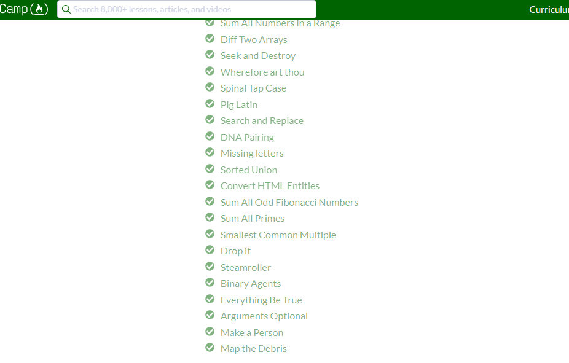
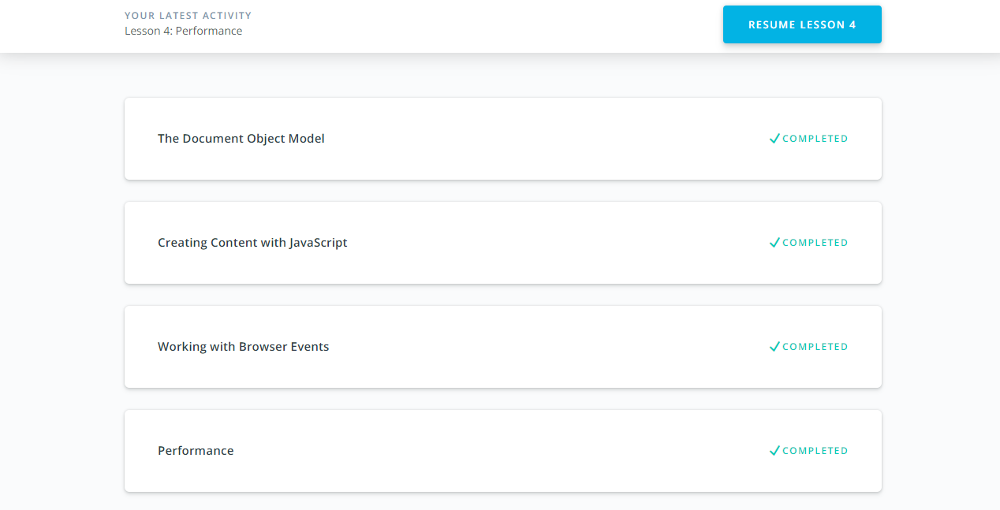

#### What was new to me
Earlier I used events but I didn't know about event life cycle. I've started to understand it. Also I never thought about perfomance, never used tools for debugging speed load.
#### Practical task
If you want to see page< please click on the [link](https://antonenko-anton.github.io/chatDB2.github.io/api/)  
And also link to the [repository](https://github.com/antonenko-anton/chatDB2.github.io/tree/master/api)
#### Screenshots

