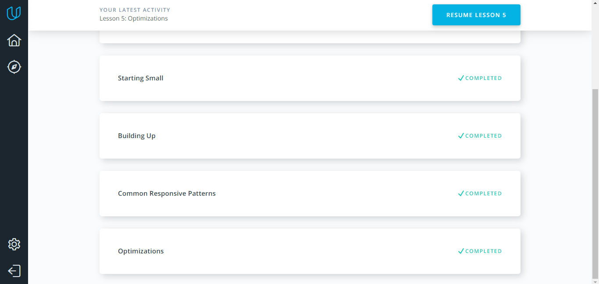
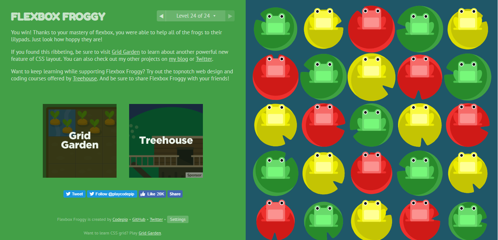

#### What was new to me
> I knew the words 'responsive web design', 'responsive layout', but I didn't understand what is this. I've started to understand site building logic.     
#### What surprised me
> I've never known about responsive patterns. When I created web site I started with large view. I didn't know the better path's creation starting from small screen.
#### What I intend to use in the future
> I'm going to use responsive design because it's really good. I like when one site looks good on the different devices.
#### Screenshots 

